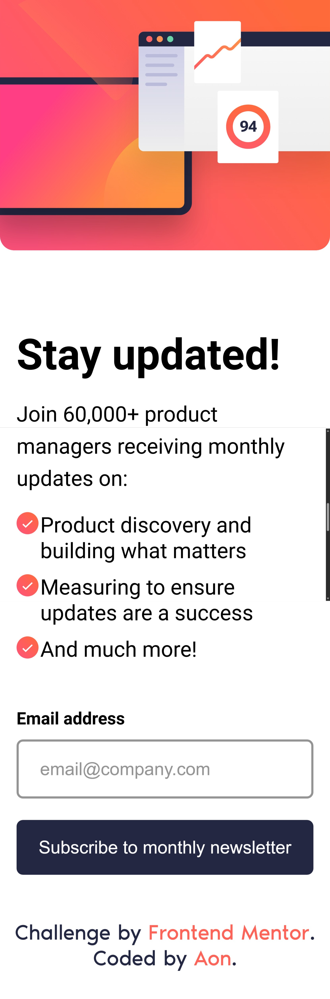
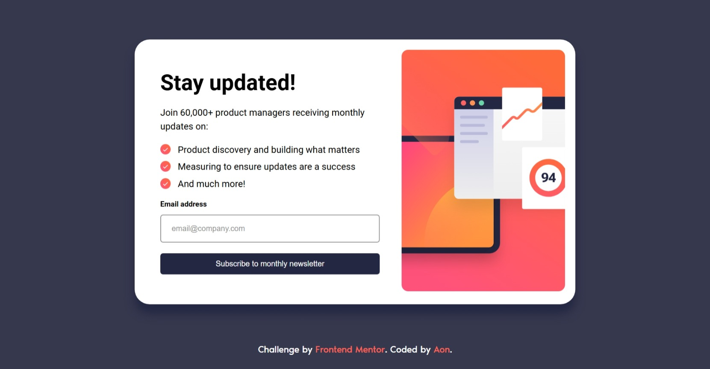
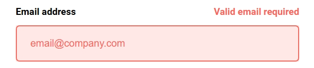
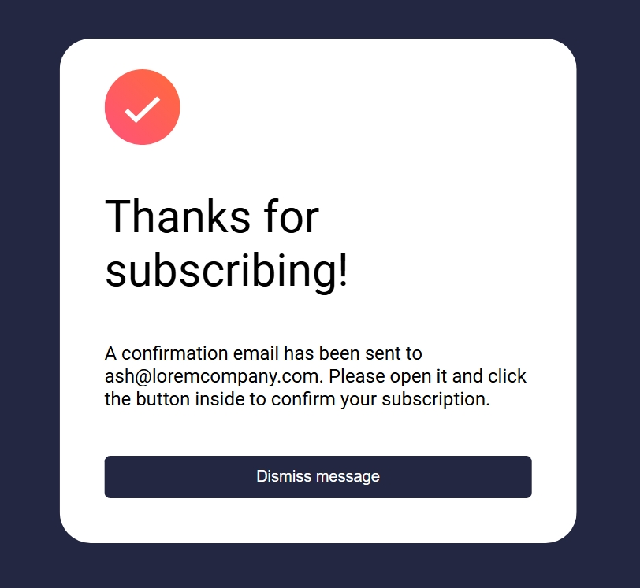

# Frontend Mentor - Newsletter sign-up form with success message solution

This is a solution to the [Newsletter sign-up form with success message challenge on Frontend Mentor](https://www.frontendmentor.io/challenges/newsletter-signup-form-with-success-message-3FC1AZbNrv). Frontend Mentor challenges help you improve your coding skills by building realistic projects.

## Table of contents

- [Frontend Mentor - Newsletter sign-up form with success message solution](#frontend-mentor---newsletter-sign-up-form-with-success-message-solution)
  - [Table of contents](#table-of-contents)
  - [Overview](#overview)
    - [The challenge](#the-challenge)
    - [Screenshot](#screenshot)
    - [Links](#links)
  - [My process](#my-process)
    - [Built with](#built-with)
    - [What I learned](#what-i-learned)
    - [AI Collaboration](#ai-collaboration)
  - [Author](#author)

## Overview

### The challenge

Users should be able to:

- Add their email and submit the form
- See a success message with their email after successfully submitting the form
- See form validation messages if:
  - The field is left empty
  - The email address is not formatted correctly
- View the optimal layout for the interface depending on their device's screen size
- See hover and focus states for all interactive elements on the page

### Screenshot

  <figure style="margin: 0; height: 100%; text-align: center; width: 40%;">
    <figcaption>Mobile preview</figcaption>
    
  </figure>

  

    <figure style="margin: 0; width: 100%; text-align: center;">
      <figcaption>Desktop preview</figcaption>
      
    </figure>
    <figure style="margin: 0; width: 100%; text-align: center;">
      <figcaption>Error preview</figcaption>
      
    </figure>
      <figure style="margin: 0; width: 100%; text-align: center;">
      <figcaption>Success preview</figcaption>
      
    </figure>
  

### Links

- [Solution URL](https://github.com/Aon-m/newsletter-sign-up-with-success-message-main/)
- [Live Server URL](https://aon-m.github.io/newsletter-sign-up-with-success-message-main/)

## My process

### Built with

- Semantic HTML5 markup
- CSS custom properties
- Flexbox
- CSS Grid
- Mobile-first workflow
- Personal Framework

### What I learned

<!-- To Be Added -->

### AI Collaboration

<!-- To Be Added -->

## Author

- Frontend Mentor - [@Aon](https://www.frontendmentor.io/profile/Aon-m)
- CSSBattle - [@Aon](https://cssbattle.dev/player/aon)
- Github - [@Aon-m](https://github.com/Aon-m)
